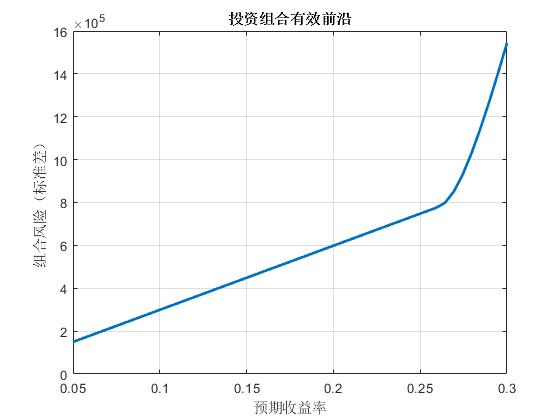

# 数学建模课程任务代码
## Task 1:
### 插值问题

1.已知当温度为T=【700，720，740，760，780】时，过热蒸汽体积的变化为V=【0.0977，0.1218，0.1406，0.1551，0.1664】，分别采用线性播值和三次样条插值求解T=750和T=770时的体积变化，并在一个图形界面中画出线性插值函数和三次样条插值函数。

<div style="text-align: center;">
    
</div>

---
 
### 拟合问题

1.现有函数 $g(x)=\frac{10a}{10b+(a-10b)e^{-asinx}}$，取 $a=1.1, b=0.01$ 计算 $x=1, 2, ..., 20$ 时，$g(x)$ 的值，把这样得到的数据作为模拟观测值，记作 $(x_i, y_i), i=1, 2, ..., 20$。
  
- （1）用lsqcurvefit拟合函数 $\hat{g}(x)$；
- （2）用fit拟合函数 $\hat{g}(x)$。

<div style="text-align: center;">
    
</div>

---

2.已知一组观测数据，如表所示
<div align="center">

| $x_i$ |   -2   |  -1.7  |  -1.4  |  -1.1  |  -0.8  |  -0.5  |  -0.2  |  0.1   |
| :---: | :----: | :----: | :----: | :----: | :----: | :----: | :----: | :----: |
| $y_i$ | 0.1029 | 0.1174 | 0.1316 | 0.1448 | 0.1556 | 0.1662 | 0.1733 | 0.1775 |

| $x_i$ |  0.4   |  0.7   |  1.0   |  1.3   |  1.6   |  1.9   |  2.2   |  2.5   |
| :---: | :----: | :----: | :----: | :----: | :----: | :----: | :----: | :----: |
| $y_i$ | 0.1785 | 0.1764 | 0.1711 | 0.1630 | 0.1526 | 0.1402 | 0.1266 | 0.1122 |

| $x_i$ |  2.8   |  3.1   |  3.4   |  3.7   |  4.0   |  4.3   |  4.6   |  4.9   |
| :---: | :----: | :----: | :----: | :----: | :----: | :----: | :----: | :----: |
| $y_i$ | 0.0977 | 0.0835 | 0.0702 | 0.0588 | 0.0479 | 0.0373 | 0.0291 | 0.0224 |

</div>

- （1）试用插值方法缩制出 $x\in[-2, 4.9]$ 区间内的曲线，并比较各种插值算法的优劣。
- （2）试用最小二乘多项式拟合方法拟合表中数据，选择一个能较好拟合数据点的多项式的阶次，给出相应多项式的系数和剩余标准差。
- （3）若表中数据满足正态分布函数$y(x)=\frac{1}{\sqrt{2\pi}}e^{-\frac{(x-\mu)^2}{2\sigma^2}}$，试用最小二乘非线性拟合方法求出分布参数 $\mu$和$\sigma$，并利用所求参数值绘制拟合曲线，观察拟合效果。
  
<div align="center">
    
</div>

观察到线性插值和三次样条插值的效果相近，但是放大观察数据点后，发现线性插值在曲线的平滑性上略逊色于三次样条插值。

<div align="center">
    
</div>

多次改变多项式的阶次，发现阶次为 6 时，拟合效果最好，剩余标准差最小。多项式系数为：
$[0, 0,  0.0008, -0.0008, -0.0173, 0.0119, 0.1764]$表达式为：
$$
y=0.0008x^2 - 0.0008x^3 - 0.0173x^4 + 0.0119x^5 + 0.1764x^6
$$

剩余标准差为 $0.0004$

<div align="center">
    
</div>

使用正太分布函数拟合数据，得到的参数为 $\mu = 0.3492 \sigma = 2.2358$, 拟合效果较好。表达式为:
$$
y = \frac{1}{\sqrt{2\pi}}e^{-\frac{(x-0.3492)^2}{2*2.2358^2}}
$$

## Task 2:
### 线性规划问题
1.求解下列线性规划问题：

$$
\begin{aligned}
\max & \quad z = 3x_1 - x_2 - x_3 \\
s.t. & \quad x_1 - 2x_2 + x_3 \leq 11 \\
& \quad -4x_1 + x_2 + 2x_3 \geq 3 \\
& \quad -2x_1 + x_3 = 1 \\
& \quad x_1, x_2, x_3 \geq 0
\end{aligned}
$$

使用 `linprog` 函数求解，得到最优解为：
$$
\begin{aligned}
x_1 &= 4 \\
x_2 &= 1 \\
x_3 &= 9 \\
z &= 2
\end{aligned}
$$
---
2.求解下列线性规划问题：
$$
\begin{aligned}
\min & \quad z = |x_1| + 2|x_2| + 3|x_3| + 4|x_4| \\
s.t. & \quad x_1 - x_2 - x_3 + x_4 = 0 \\
& \quad x_1 - x_2 + x_3 - 3x_4 = 1 \\
& \quad x_1 - x_2 - 2x_3 +3x_4 = -\frac{1}{2} \\
\end{aligned}
$$

做变量替换 $u_i = \frac{x_i+|x_i|}{2}, v_i = \frac{x_i-|x_i|}{2}, i=1,2,3,4$，记 $u=[u_1, u_2, u_3, u_4]^T, v=[v_1, v_2, v_3, v_4]^T$，则原问题可以转化为：
$$
\begin{aligned}
\min & \quad z = c^T(u+v) \\
s.t. & \quad Au = b \\
& \quad u, v \geq 0  
\end{aligned}
$$

其中 $c = [1, 2, 3, 4]^T, A = \begin{bmatrix} 1 & -1 & -1 & 1 \\ 1 & -1 & 1 & -3 \\ 1 & -1 & -2 & 3 \end{bmatrix}, b = [0, 1, -\frac{1}{2}]^T$

然后使用 `linprog` 函数求解，得到最优解为：


$$
\begin{aligned}
x_1 &= 0.25 \\
x_2 &= 0 \\
x_3 &= 0 \\
x_4 &= -0.25 \\
z &= 1.25
\end{aligned}
$$

---

3.一架货机有三个货舱：前舱、中仓和后舱。三个货舱所能装载的货物最大之类和体积有限制如表1所示。为了维持飞机平衡，三个货舱装载的货物之类必须与其最大容许量成比例。

<div align="center">
表1 货舱数据 <br>

|             | 前舱  | 中仓  | 后舱  |
| :---------: | :---: | :---: | :---: |
| 质量限制/t  |  10   |  16   |   8   |
| 体积限制/m³ | 6800  | 8700  | 5300  |
</div>

现有四类货物用于装载，其质量和体积以及装运后的利润如表2所示。
<div align="center">
表2 货物数据 <br>

| 货物  | 质量/t | 体积/m³ | 利润/(元/t) |
| :---: | :----: | :-----: | :---------: |
| 货物1 |   18   |   480   |    3100     |
| 货物2 |   15   |   650   |    3800     |
| 货物3 |   23   |   580   |    3500     |
| 货物4 |   12   |   390   |    2850     |
</div>

假设：
- 每种货物可以无限细分；
- 每种货物可以分布在一个或多个货舱中；
- 不同货物可以放在同一个货舱中，并且保证不留空间；
  
应该如何安排货物的装载，才能使得飞机的利润最大？

为了便于计算，使用如下定义：<br>
$x_{ij}$ 表示货物 $i$ 在货舱 $j$ 中的装载质量（吨），其中 $i\in{1,2,3,4}$，$j\in\{前舱(1),中舱(2),后舱(3)\}$;
用 $p_i$ 表示货物 $i$ 的单位利润（元/吨）, $v_i$ 表示货物 $i$ 的体积（m³）, $m_i$ 表示货物 $i$ 的总质量（吨）。

那么目标函数可以表示为：
$$
\begin{aligned} 
\max & \quad z = \sum_{i=1}^{4}\sum_{j=1}^{3}x_{ij}p_i \tag{1}
\end{aligned}
$$

接下来分别表示质量和体积的约束条件。<br>质量约束，即四种货物的总质量不超过每部分的承载质量，表示为：
$$

\begin{aligned}
&\begin{cases}
\sum_{i=1}^{4}x_{i1} \leq 10, \\
\sum_{i=1}^{4}x_{i2} \leq 16, \\
\sum_{i=1}^{4}x_{i3} \leq 8,
\end{cases} \tag{2}
\end{aligned}
$$

货物的总体积约束表示为：
$$
\begin{aligned}
&\begin{cases}
\sum_{i=1}^{4}x_{i1}\frac{v_i}{m_i} \leq 6800, \\
\sum_{i=1}^{4}x_{i2}\frac{v_i}{m_i} \leq 8700, \\
\sum_{i=1}^{4}x_{i3}\frac{v_i}{m_i} \leq 5300,
\end{cases} \tag{3}
\end{aligned}
$$

还需要添加比例的约束条件，即货舱中的货物质量与体积的比例应该相同。假设比例系数 $\lambda$，可以表示为两个等式约束：
$$
\begin{aligned}
&\begin{cases}
M_1 = \sum_{i=1}^{4}x_{i1} = 10\lambda, \\
M_2 = \sum_{i=1}^{4}x_{i2} = 16\lambda, \\ 
M_3 = \sum_{i=1}^{4}x_{i3} = 8\lambda,
\end{cases}\Rightarrow 
\begin{cases}
16M_1 - 10M_2 = 0, \\
8M_2 - 16M_3 = 0,
\end{cases}
\tag{4}
\end{aligned}
$$

最后，还需要添加每个货品自身的上限数量约束：
$$
\begin{aligned}
&\begin{cases}
\sum_{j=1}^{3}x_{1j} \leq 18, \\
\sum_{j=1}^{3}x_{2j} \leq 15, \\
\sum_{j=1}^{3}x_{3j} \leq 23, \\
\sum_{j=1}^{3}x_{4j} \leq 12,
\end{cases} \tag{5}
\end{aligned}
$$

最终，将目标函数和约束条件输入 `linprog` 函数求解，得到最优装配方案为：


<div align="center">

|       | 前舱  |  中仓   | 后舱  |
| :---: | :---: | :-----: | :---: |
| 货物1 |   0   |    0    |   0   |
| 货物2 |  10   |    0    |   5   |
| 货物3 |   0   | 12.9474 |   3   |
| 货物4 |   0   | 3.0526  |   0   |

</div>

此时，飞机的最大利润为  $z = 121515.79$.

## Task 3:
### 整数规划问题
1.试将下述非线性的 0-1 规划问题转换成线性的 0-1 规划问题。
$$
\begin{aligned}
\max & \quad z = x_1+x_1x_2-x_3 \\
s.t. & \quad -2x_1+3x_2+x_3 \leq 3 \\
& \quad x_j=0 或 1, j=1,2,3 \\
\end{aligned}
$$

由于 $x_1$ 和 $x_2$ 只能取 0 或 1，因此可以将 $x_1x_2$ 转换为 $x_4$，即 $x_4 = x_1x_2$。<br>然后可以将目标函数和约束条件转换为线性形式：
$$

\begin{aligned}
\max & \quad z = x_1+x_4-x_3 \\
s.t. & \quad -2x_1+3x_2+x_3 \leq 3 \\
& \quad x_4 \leq x_1 \\
& \quad x_4 \leq x_2 \\
& \quad x_4 \geq x_1+x_2-1 \\
& \quad x_j=0 或 1, j=1,2,3,4 \\
\end{aligned}
$$

---

2. 某公司新购置了某种设备6台，欲分配给下属的4个企业，已知各企业获得这种设备后年创利润如表3.1所示，单位为千万元。应如何分配这些设备才能使年创总利润最大?最大利润是多少?

<div align="center">
表3.1 各企业获得设备的年创利润数 <br>

| 设备  |  甲   |  乙   |  丙   |  丁   |
| :---: | :---: | :---: | :---: | :---: |
|   1   |   4   |   2   |   3   |   4   |
|   2   |   6   |   4   |   5   |   5   |
|   3   |   7   |   6   |   7   |   6   |
|   4   |   7   |   8   |   8   |   6   |
|   5   |   7   |   9   |   8   |   6   |
|   6   |   7   |  10   |   8   |   6   |

</div>

首先定义决策变量：

$$

x_{ij} = \begin{cases}
1, & \text{第 } i \text{ 台设备分配给企业 } j \\
0, & \text{否则}
\end{cases}
$$

其中 $(i = 1,2,\dots,6), (j = 1,2,3,4)$ 分别对应 甲、乙、丙、丁，然后定义目标函数：<br>

$$
\max \sum_{i=1}^{6} \sum_{j=1}^{4} p_{ij} x_{ij}
$$

其中 $(p_{ij})$ 是表格中的利润。
每台设备只能分配给一个企业的限制条件为：
$$
\sum_{j=1}^{4} x_{ij} = 1 \quad \text{对所有 } i = 1,\dots,6
$$

决策变量为0-1整数：

$$
[x_{ij} \in \{0,1\}]
$$

```matlab
clear; clc;

% 设备利润矩阵 P(i,j)：第i台设备给第j个企业带来的利润（千万元）
P = [4 2 3 4;
     6 4 5 5;
     7 6 7 6;
     7 8 8 6;
     7 9 8 6;
     7 10 8 6];

[m, n] = size(P); % m=6设备数，n=4企业数
prob = optimproblem('ObjectiveSense', 'maximize');

x = optimvar('x', m, n, 'Type', 'integer', 'LowerBound', 0, 'UpperBound', 1);

profit_expr = sum(sum(P .* x)); % 元素对应相乘再求和
prob.Objective = profit_expr;

assign_constraints = sum(x, 2) == 1;

prob.Constraints.assign = assign_constraints;

[sol, fval, exitflag, output] = solve(prob);
fprintf('最大利润为：%.2f 千万元\n', fval);
firm_names = ["甲", "乙", "丙", "丁"];
for i = 1:m
    assigned = find(sol.x(i, :) > 0.5); % 找出该设备分配给哪个企业
    fprintf('设备 %d 分配给企业 %s\n', i, firm_names(assigned));
end
```

求解得最大利润为：44.00 千万元，设备 1, 2, 3 分配给企业 甲，设备 4, 5, 6 分配给企业 乙。

---

3.求解下列线性规划问题
$$
\begin{aligned}
\max & \quad z = 20x_1+90x_2+80x_3+70x_4+30x_5 \\
s.t. & \quad x_1+x_2+x_5 \geq 30 \\
& \quad x_3+x_4\geq 30 \\
& \quad 3x_1+2x_3\leq 120 \\
& \quad 3x_2+2x_4+x_5\leq 48 \\
& \quad x_j\geq 0且为整数, j=1,2,3,4,5 \\
\end{aligned}
$$

```matlab
clear; clc;

x = optimvar('x', 5, 'Type', 'integer', 'LowerBound', 0);
obj = -[20, 90, 80, 70, 30] * x;
prob = optimproblem('Objective', obj, 'ObjectiveSense', 'min');

cons = [
    -x(1) - x(2) - x(5) <= -30;
    -x(3) - x(4) <= -30;
     3*x(1) + 2*x(3) <= 120;
     3*x(2) + 2*x(4) + x(5) <= 48;
];

prob.Constraints.cons = cons;
[sol, fval, exitflag, output] = solve(prob);

disp("最优解为：")
disp(sol.x)
disp("最大目标函数值为：")
disp(-fval)
```

求解得最优解为：$x_1=0, x_2=0, x_3=60, x_4=9, x_5=30$，最大目标函数值为：$z=6330$


---

## Task 4:
### 非线性规划问题

1.求解下列非线性整数规划问题：
$$
\begin{aligned}
\max & \quad z = x^2_1 + x^2_2 + 3x^2_3 + 4 x^2_4 + 2x^2_5 -8x_1 -2x_2 - 3x_3 -x_4 - 2x_5, \\
s.t. & \quad 0 \le x_i \le 99, 且 x_i 为整数 (i=1,2,\dots,5), \\
& \quad x_1 + x_2 + x_3 + x_4 + x_5 \leq 400, \\
& \quad x_1 + 2x_2 +2x_3 + x_4 + 6x_5 \leq 800, \\
& \quad 2x_1 + x_2 + 6x_3 \leq 200, \\
& \quad x_3 + x_4 + 5x_5 \le 200. \\
\end{aligned}
$$

使用optiprob函数求解，得到最优解为：
最优解：$x_1=50, x_2=99, x_3=0, x_4=99, x_5=20$  
目标函数值：$z=51568$

---
2.组合投资何题。现有50万元基金用于投资三种股果A、B、C。A每股年期望收益为5元（标准差2元）,目前市价20元；B每股年期望收益8元（标准差6元），目前市价25元；C每股年期望收益为10元（标准差10元），目前市价30元；股票A，B收益的相关系数为5/24，股票A、C收益的相关系数为-0.5，股票B、C收益的相关系数为-0.25。假基金不一定要用完〔不计利息或贬值），风险通常用收益的方差或标准差衡量。

- （1）期望今年得到至少20%投资回报，应如何投资?
- （2）投资回报率与风险的关系如何?

对题目中的数据进行整理，得到如下表格：

| 股票  | 每股收益（元） | 每股价格（元） | 标准差 |
| :---: | :------------: | :------------: | :----: |
|   A   |       5        |       20       |   2    |
|   B   |       8        |       25       |   6    |
|   C   |       10       |       30       |   10   |

总资金：500,000元; 投资数量变量：分别为 $x_1$、$x_2$、$x_3$，表示买入的股票A、B、C的股数（单位为股）。

收益期望函数：
$$
E[R] = 5x_1 + 8x_2 + 10x_3
$$
 
成本约束：
$$ 
20x_1 + 25x_2 + 30x_3 \leq 500000
$$

用协方差矩阵 $Σ$ 来表示风险：
$$

Σ = \begin{bmatrix}
4 & 5 & -10 \\
5 & 36 & -15 \\
-10 & -15 & 100
\end{bmatrix}
$$

对应的方差：
$$
Var(R) = x^TQx,其中 Q = D^TΣD
$$

$$
D = diag(20, 25, 30)
$$
$D$是将“股数”转换为“投资金额”的因子，因为要按金额权重来计算风险。

对于第一问，要求期望收益率大于等于20%，即目标为最小化风险，约束条件包括投资不超过50万元和期望收益率大于等于20%。

使用`optiprob`函数求解，得到最优解为：

- 股票A：$x_1=16634$股, $332680$元
- 股票B：$x_2=190$股, $4750$元
- 股票C：$x_3=1531$股, $45930$元

合计金额：$383360$元，组合总收益: $100000$元，组合风险（标准差）：$598439.70$元。

对于第二问，通过将期望收益作为约束，从较低收益逐步提高到更高收益，观察风险的变化。

结果如图所示：
<div align="center">
    
</div>


---

3.用Matlab求解：
$$
\begin{aligned}
\max & \quad z = c^Tx + \frac{1}{2}x^TQx,\\
s.t. & \quad -1 \le x_1x_2 + x_3x_4 \le 1 \\
& \quad -3 \le x_1 + x_2 + x_3 + x_4 \le 2, \\
& \quad x_i \in \{-1,1\}, i=1,2,\dots,4. \\
\end{aligned}
$$

式中：$c=[6,8,4,2]^T; x=[x_1,x_2,x_3,x_4]^T; Q$ 是三对角线矩阵，主对角线上元素全为1，两条次对角线上的元素全为2.

题中一共有4个变量，2个不等式约束，1个目标函数。因此可以考虑使用枚举法来求解，找到目标函数的最大值。

最优解为：$x_1=1, x_2=1, x_3=1, x_4=-1$，对应的目标函数值为：$z=20$。


## Task 5:

### 微分方程
1.求下列微分方程符号解和数值解，并画出解的图形。
$$
x^2y''+xy'+(x^2-n^2)y=0, y(\frac{\pi}{2})=2, y'(\frac{\pi}{2})=-\frac{2}{\pi}(Bessel方程，取n=1/2)
$$

使用dsolve函数求解，得到符号解为：
$$
\frac{5734161139222659 \pi cos(x) - 18014398509481984 cos(x) + 18014398509481984 \pi sin(x)}{18014398509481984 \sqrt {\frac{\pi}{2}x}}
$$

再使用ode45计算数值解，符号解和数值解的图形对比如下：

<div align="center">
    
</div>

2.求下列微分方程数值解
$$
\begin{cases}
x' = -x^3, & x(0) = 1, \\
y' = x - y^3, & y(0) = 0.5
\end{cases}
\space \space 0 \leq t \leq 30.
$$

x和y关于t的数值解图形如下：

<div align="center">
    
</div>

x与y的关系图形如下：

<div align="center">
    
</div>

3.一只小船渡过宽为d的河流，目标是超点A正对着的另一岸B点。已知河水流速 $v_1$ 与船在、静水中的速度 $v_2$ 之比为 $k$。  
（1）建立小船航线的方程，求其解析解。  
（2）设 $d=100m,v_1=1m/s, v_2=2m/s$, 用数值解法求渡河所需时间、任意时刻小船的位置及航行曲线，作图并与解析解进行比较。

对于问题1，设河流宽度为 $d$，即 A 点在 $(0,0)$，B 点在 $(0,d)$；河水流速为 $v_1$，方向是水平方向（x轴方向）；船在静水中的速度为 $v_2$，船头始终指向B点。  
令船在某一时刻的位置为 $(x(t), y(t))$，船头始终指向目标点 $B = (0,d)$。  
船头方向指向B点，与 $(x(t), y(t))$ 之间连线方向一致：
$$
\text{单位向量方向} = \frac{(0 - x(t), d - y(t))}{\sqrt{x(t)^2 + (d - y(t))^2}}
$$

船速大小为 $v_2$，所以船的实际运动速度为：

$$
\left( \frac{-v_2 x(t)}{\sqrt{x(t)^2 + (d - y(t))^2}}, \frac{v_2 (d - y(t))}{\sqrt{x(t)^2 + (d - y(t))^2}} \right)
$$

由于水流速度为 $v_1$（x方向），所以总速度为：

$$
\frac{dx}{dt} = -\frac{v_2 x}{\sqrt{x^2 + (d - y)^2}} + v_1
$$

$$
\frac{dy}{dt} = \frac{v_2 (d - y)}{\sqrt{x^2 + (d - y)^2}}
$$

将以上表达整理得到微分方程组：

$$
\begin{cases}
\frac{dx}{dt} = -\frac{v_2 x}{\sqrt{x^2 + (d - y)^2}} + v_1 \\
\frac{dy}{dt} = \frac{v_2 (d - y)}{\sqrt{x^2 + (d - y)^2}}
\end{cases}
$$

其中初始条件为： $x(0) = 0, y(0) = 0$。由于该方程组是非线性的，解析解求解较为复杂，使用数值解法求解。  
设定d=1，k=0.5，使用 `ode45` 来求这个微分方程系统的数值解，得到的曲线如下：

<div align="center">
    
</div>

对于问题2，$d=100m, v_1=1m/s, v_2=2m/s$，求得最终的航行时间约为 $t=66.65s$，小船在任意时刻的位置如下：

<div align="center">
    
</div>

观察到，数值解和解析解的图像非常接近，说明数值解法是有效的。