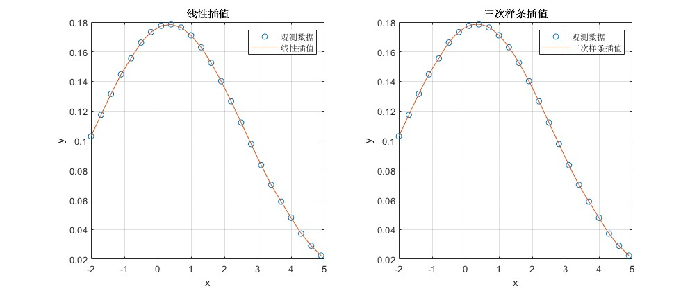

# 数学建模课程任务代码
## Task 1:
### 插值问题

1.已知当温度为T=【700，720，740，760，780】时，过热蒸汽体积的变化为V=【0.0977，0.1218，0.1406，0.1551，0.1664】，分别采用线性播值和三次样条插值求解T=750和T=770时的体积变化，并在一个图形界面中画出线性插值函数和三次样条插值函数。

    

---
 
### 拟合问题

1.现有函数 $g(x)=\frac{10a}{10b+(a-10b)e^{-asinx}}$，取 $a=1.1, b=0.01$ 计算 $x=1, 2, ..., 20$ 时，$g(x)$ 的值，把这样得到的数据作为模拟观测值，记作 $(x_i, y_i), i=1, 2, ..., 20$。
  
- （1）用lsqcurvefit拟合函数 $\hat{g}(x)$；
- （2）用fit拟合函数 $\hat{g}(x)$。

    

---

2.已知一组观测数据，如表所示

| $x_i$ |   -2   |  -1.7  |  -1.4  |  -1.1  |  -0.8  |  -0.5  |  -0.2  |  0.1   |
| :---: | :----: | :----: | :----: | :----: | :----: | :----: | :----: | :----: |
| $y_i$ | 0.1029 | 0.1174 | 0.1316 | 0.1448 | 0.1556 | 0.1662 | 0.1733 | 0.1775 |

| $x_i$ |  0.4   |  0.7   |  1.0   |  1.3   |  1.6   |  1.9   |  2.2   |  2.5   |
| :---: | :----: | :----: | :----: | :----: | :----: | :----: | :----: | :----: |
| $y_i$ | 0.1785 | 0.1764 | 0.1711 | 0.1630 | 0.1526 | 0.1402 | 0.1266 | 0.1122 |

| $x_i$ |  2.8   |  3.1   |  3.4   |  3.7   |  4.0   |  4.3   |  4.6   |  4.9   |
| :---: | :----: | :----: | :----: | :----: | :----: | :----: | :----: | :----: |
| $y_i$ | 0.0977 | 0.0835 | 0.0702 | 0.0588 | 0.0479 | 0.0373 | 0.0291 | 0.0224 |

- （1）试用插值方法缩制出 $x\in[-2, 4.9]$ 区间内的曲线，并比较各种插值算法的优劣。
- （2）试用最小二乘多项式拟合方法拟合表中数据，选择一个能较好拟合数据点的多项式的阶次，给出相应多项式的系数和剩余标准差。
- （3）若表中数据满足正态分布函数$y(x)=\frac{1}{\sqrt{2\pi}}e^{-\frac{(x-\mu)^2}{2\sigma^2}}$，试用最小二乘非线性拟合方法求出分布参数 $\mu$和$\sigma$，并利用所求参数值绘制拟合曲线，观察拟合效果。
  

    

观察到线性插值和三次样条插值的效果相近，但是放大观察数据点后，发现线性插值在曲线的平滑性上略逊色于三次样条插值。

    

多次改变多项式的阶次，发现阶次为 6 时，拟合效果最好，剩余标准差最小。多项式系数为：
$[0, 0,  0.0008, -0.0008, -0.0173, 0.0119, 0.1764]$表达式为：
$$
y=0.0008x^2 - 0.0008x^3 - 0.0173x^4 + 0.0119x^5 + 0.1764x^6
$$

剩余标准差为 $0.0004$

    

使用正太分布函数拟合数据，得到的参数为 $\mu = 0.3492 \sigma = 2.2358$, 拟合效果较好。表达式为:
$$
y = \frac{1}{\sqrt{2\pi}}e^{-\frac{(x-0.3492)^2}{2*2.2358^2}}
$$

## Task 2:
### 线性规划问题
1.求解下列线性规划问题：
$$
\begin{aligned}
\max & \quad z = 3x_1 - x_2 - x_3 \\
s.t. & \quad x_1 - 2x_2 + x_3 \leq 11 \\
& \quad -4x_1 + x_2 + 2x_3 \geq 3 \\
& \quad -2x_1 + x_3 = 1 \\
& \quad x_1, x_2, x_3 \geq 0
\end{aligned}
$$

使用 `linprog` 函数求解，得到最优解为：
$$
\begin{aligned}
x_1 &= 4 \\
x_2 &= 1 \\
x_3 &= 9 \\
z &= 2
\end{aligned}
$$
---
2.求解下列线性规划问题：
$$
\begin{aligned}
\min & \quad z = |x_1| + 2|x_2| + 3|x_3| + 4|x_4| \\
s.t. & \quad x_1 - x_2 - x_3 + x_4 = 0 \\
& \quad x_1 - x_2 + x_3 - 3x_4 = 1 \\
& \quad x_1 - x_2 - 2x_3 +3x_4 = -\frac{1}{2} \\
\end{aligned}
$$

做变量替换 $u_i = \frac{x_i+|x_i|}{2}, v_i = \frac{x_i-|x_i|}{2}, i=1,2,3,4$，记 $u=[u_1, u_2, u_3, u_4]^T, v=[v_1, v_2, v_3, v_4]^T$，则原问题可以转化为：
$$
\begin{aligned}
\min & \quad z = c^T(u+v) \\
s.t. & \quad Au = b \\
& \quad u, v \geq 0  
\end{aligned}
$$

其中 $c = [1, 2, 3, 4]^T, A = \begin{bmatrix} 1 & -1 & -1 & 1 \\ 1 & -1 & 1 & -3 \\ 1 & -1 & -2 & 3 \end{bmatrix}, b = [0, 1, -\frac{1}{2}]^T$

然后使用 `linprog` 函数求解，得到最优解为：

$$
\begin{aligned}
x_1 &= 0.25 \\
x_2 &= 0 \\
x_3 &= 0 \\
x_4 &= -0.25 \\
z &= 1.25
\end{aligned}
$$

---
3.一架货机有三个货舱：前舱、中仓和后舱。三个货舱所能装载的货物最大之类和体积有限制如表1所示。为了维持飞机平衡，三个货舱装载的货物之类必须与其最大容许量成比例。

表1 货舱数据  

|             | 前舱  | 中仓  | 后舱  |
| :---------: | :---: | :---: | :---: |
| 质量限制/t  |  10   |  16   |   8   |
| 体积限制/m³ | 6800  | 8700  | 5300  |

现有四类货物用于装载，其质量和体积以及装运后的利润如表2所示。

表2 货物数据  

| 货物  | 质量/t | 体积/m³ | 利润/(元/t) |
| :---: | :----: | :-----: | :---------: |
| 货物1 |   18   |   480   |    3100     |
| 货物2 |   15   |   650   |    3800     |
| 货物3 |   23   |   580   |    3500     |
| 货物4 |   12   |   390   |    2850     |

假设：
- 每种货物可以无限细分；
- 每种货物可以分布在一个或多个货舱中；
- 不同货物可以放在同一个货舱中，并且保证不留空间；
  
应该如何安排货物的装载，才能使得飞机的利润最大？

为了便于计算，使用如下定义： 
$x_{ij}$ 表示货物 $i$ 在货舱 $j$ 中的装载质量（吨），其中 $i\in{1,2,3,4}$，$j\in\{前舱(1),中舱(2),后舱(3)\}$;
用 $p_i$ 表示货物 $i$ 的单位利润（元/吨）, $v_i$ 表示货物 $i$ 的体积（m³）, $m_i$ 表示货物 $i$ 的总质量（吨）。

那么目标函数可以表示为：
$$
\begin{aligned} 
\max & \quad z = \sum_{i=1}^{4}\sum_{j=1}^{3}x_{ij}p_i \tag{1}
\end{aligned}
$$

接下来分别表示质量和体积的约束条件。 质量约束，即四种货物的总质量不超过每部分的承载质量，表示为：
$$

\begin{aligned}
&\begin{cases}
\sum_{i=1}^{4}x_{i1} \leq 10, \\
\sum_{i=1}^{4}x_{i2} \leq 16, \\
\sum_{i=1}^{4}x_{i3} \leq 8,
\end{cases} \tag{2}
\end{aligned}
$$

货物的总体积约束表示为：
$$
\begin{aligned}
&\begin{cases}
\sum_{i=1}^{4}x_{i1}\frac{v_i}{m_i} \leq 6800, \\
\sum_{i=1}^{4}x_{i2}\frac{v_i}{m_i} \leq 8700, \\
\sum_{i=1}^{4}x_{i3}\frac{v_i}{m_i} \leq 5300,
\end{cases} \tag{3}
\end{aligned}
$$

最后，还需要添加比例的约束条件，即货舱中的货物质量与体积的比例应该相同。假设比例系数 $\lambda$，可以表示为两个等式约束：
$$
\begin{aligned}
&\begin{cases}
M_1 = \sum_{i=1}^{4}x_{i1} = 10\lambda, \\
M_2 = \sum_{i=1}^{4}x_{i2} = 16\lambda, \\ 
M_3 = \sum_{i=1}^{4}x_{i3} = 8\lambda,
\end{cases}\Rightarrow 
\begin{cases}
16M_1 - 10M_2 = 0, \\
10M_1 - 8M_3 = 0,
\end{cases}
\tag{4}
\end{aligned}
$$

最终，将目标函数和约束条件输入 `linprog` 函数求解，得到最优装配方案为：

| | 前舱 | 中仓 | 后舱 |
| :---: | :---: | :---: | :---: |
| 货物1 | 0 | 0 | 0 |
| 货物2 | 10 | 16 | 0 |
| 货物3 | 0 | 0 | 8 |
| 货物4 | 0 | 0 | 0 |

此时，飞机的最大利润为  $z = 126800$.